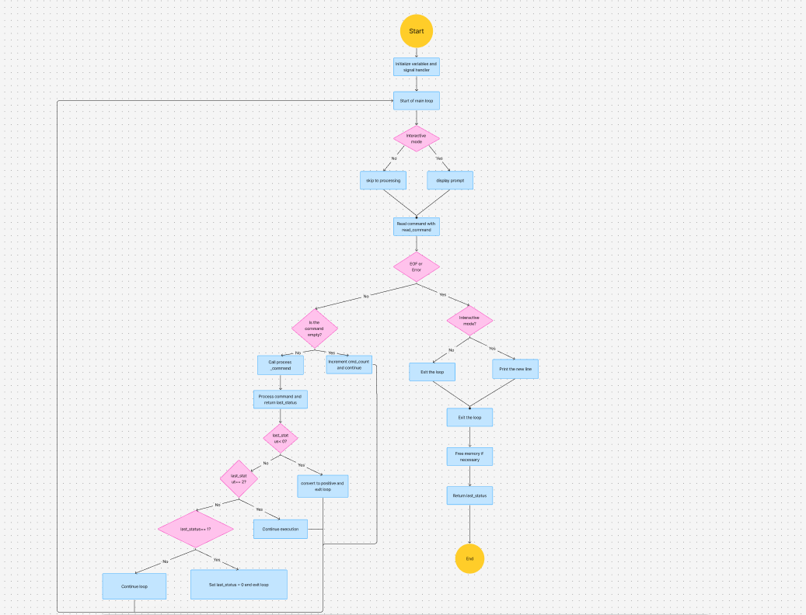
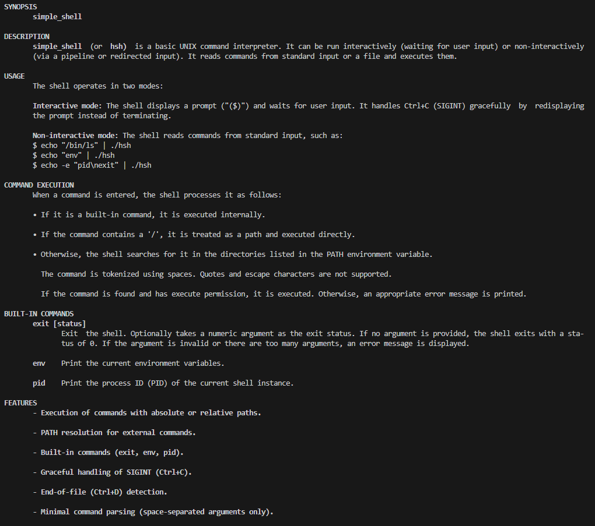
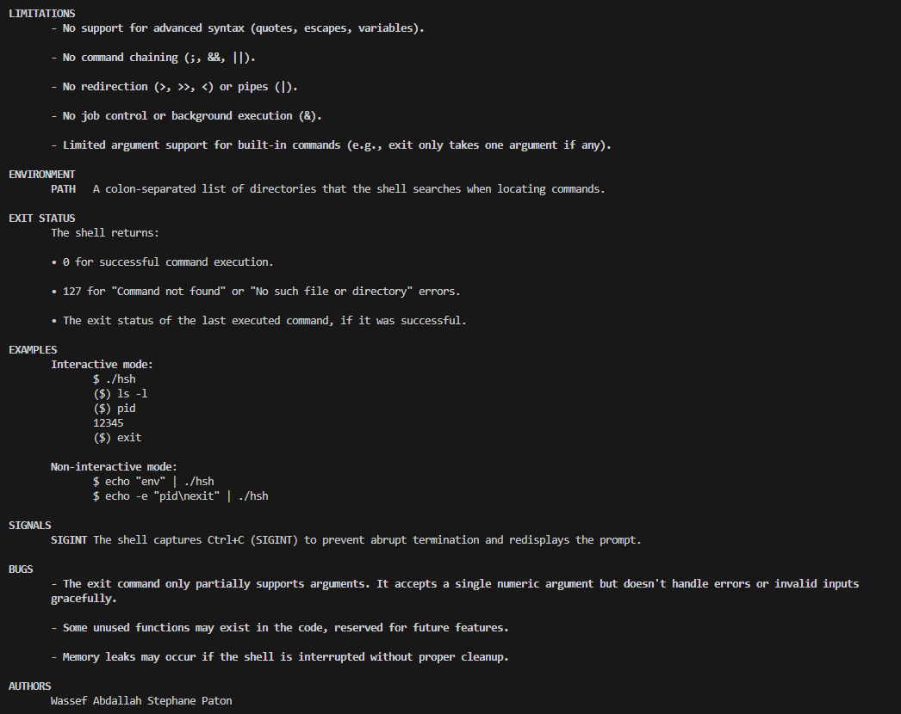

# Simple Shell Project

## Description
This is a simple UNIX command interpreter created as part of the Holberton School curriculum. The shell can read and execute commands from standard input or files. It supports basic command execution, built-in commands, and PATH resolution.

## Features
- Execute commands using their full path (e.g., `/bin/ls`)
- Execute commands using the PATH environment variable (e.g., `ls`)
- Handle command line arguments (e.g., `ls -l /tmp`)
- Support for built-in commands:
  - `exit`: Exit the shell
  - `env`: Print the current environment variables
  - `pid`: Print the process ID of the shell
- Handle the End-Of-File condition (Ctrl+D)
- Handle signals (Ctrl+C)

## Requirements
- Compiled on Ubuntu 20.04 LTS using gcc with the options: `-Wall -Werror -Wextra -pedantic -std=gnu89`
- All files end with a new line
- Code follows the Betty style
- No more than 5 functions per file
- All header files are include guarded

### Authorized Functions
The following functions are authorized for use in this project:

#### Standard Library Functions
- All functions from `string.h`
- `malloc`, `free`, `perror`, `printf`, `fprintf`, `vfprintf`, `sprintf`, `putchar`, `fflush`

#### File and Directory Management
- `access`, `open`, `close`, `read`, `write`, `stat`, `lstat`, `fstat`, `opendir`, `readdir`, `closedir`, `getcwd`, `chdir`

#### Process Management
- `fork`, `execve`, `_exit`, `exit`, `wait`, `waitpid`, `wait3`, `wait4`, `kill`, `getpid`

#### Input/Output
- `getline`, `isatty`

#### Signal Handling
- `signal`

## Compilation
To compile the shell, use the following command:
```bash
gcc -Wall -Werror -Wextra -pedantic -std=gnu89 *.c -o hsh
```

## Usage
### Interactive Mode
```bash
$ ./hsh
($) ls
file1 file2 file3
($) exit
$
```

### Non-Interactive Mode
```bash
$ echo "ls" | ./hsh
file1 file2 file3
$
```

### Using a Pipe
```bash
$ echo "ls -l | grep file" | ./hsh
-rw-r--r-- 1 user user  0 Apr 23 12:00 file1
-rw-r--r-- 1 user user  0 Apr 23 12:00 file2
$
```

## Files
| File              | Description                                                                 |
|-------------------|-----------------------------------------------------------------------------|
| `shell.c`         | Main program and shell loop                                                |
| `executor.c`      | Functions to execute commands                                              |
| `parser.c`        | Functions to parse input                                                   |
| `path.c`          | Functions to handle PATH                                                   |
| `env_utils.c`     | Functions to handle environment variables                                  |
| `builtins.c`      | Implementation of built-in commands (`exit`, `env`, `pid`)                 |
| `shell.h`         | Header file containing function prototypes and shared definitions          |
| `man_1_simple_shell` | Manual page for the shell                                               |

## Function Prototypes
The following prototypes are declared in `shell.h`:

```c
/* Environment-related functions */
char *find_command_in_path(char *command);
char *_getenv(char *name);

/* Parser functions */
char **split_line(char *line);
void free_args(char **args);

/* Executor functions */
int execute_command(char **args, char *program_name, int cmd_count);
int command_error(char **args, char *program_name, int cmd_count);

/* Shell core functions */
void handle_sigint(int sig);
void handle_sigsegv(int sig);
ssize_t read_command(char **line, size_t *len);
int process_command(char *line, char *program_name, int cmd_count);

/* Built-in commands */
int exit_builtin(char **args, char *program_name);
int env_builtin(char **args);
int pid_builtin(char **args);
```

## Examples
### Interactive Mode
```bash
$ ./hsh
($) ls -l
total 20
-rw-r--r-- 1 user user  0 Apr 23 12:00 file1
-rw-r--r-- 1 user user  0 Apr 23 12:00 file2
($) pid
12345
($) exit
$
```

### Non-Interactive Mode
```bash
$ echo "ls -l" | ./hsh
total 20
-rw-r--r-- 1 user user  0 Apr 23 12:00 file1
-rw-r--r-- 1 user user  0 Apr 23 12:00 file2
$
```

### Using a Pipe
```bash
$ echo "ls -l | grep file" | ./hsh
-rw-r--r-- 1 user user  0 Apr 23 12:00 file1
-rw-r--r-- 1 user user  0 Apr 23 12:00 file2
$
```
## Flowchart




## How to Execute the Manual Page
To view the manual page for the shell, use the following command:
```bash
man ./man_1_simple_shell
```



## How to Check Memory Leaks
To check for memory leaks, use `valgrind`:
```bash
valgrind --leak-check=full --track-origins=yes ./hsh
```

## Bugs
- **Memory Leaks**: Memory leaks may occur if the shell is interrupted (e.g., with Ctrl+C) without proper cleanup.
- **Exit Command**: The `exit` command only partially supports arguments. It accepts a single numeric argument but doesn't handle errors or invalid inputs gracefully.
- **PATH Handling**: If the PATH environment variable is empty or unset, the shell may not behave as expected.

## Implementation Challenges
The most challenging parts of implementing the shell were:
1. **Managing the `exit` command**:
   - Handling numeric arguments, invalid arguments, and too many arguments without breaking the shell.
   - Ensuring proper memory cleanup before exiting.
2. **PATH resolution**:
   - Searching for commands in the directories listed in the PATH environment variable.
   - Handling edge cases like empty PATH or commands with absolute paths.
3. **Memory management**:
   - Avoiding memory leaks by ensuring all dynamically allocated memory is freed.
   - Handling errors gracefully without leaving allocated memory behind.

## Conclusion
This project provided a deep understanding of how a shell works, including command parsing, process creation, and signal handling. It also emphasized the importance of robust error handling and memory management in C programming. The shell is functional and adheres to the requirements, but it has limitations such as the lack of support for advanced shell features like pipes, redirection, and job control.

## Authors
- Stephane Paton
- Wassef Abdallah
